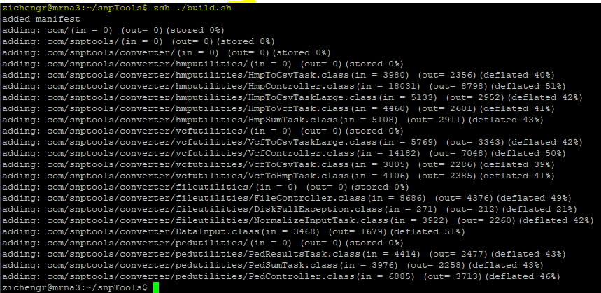

# snpTools - User Manual
***
This user manual will introduce how to correctly compile and run the snpTools program in Windows environment.
To ensure that different users have the same operating environment, 
our program needs to run on a server such as Ubuntu Server. Therefore, You need to prepare a server first and upload the snpTools program to the server.

# Requirements:

* Server

* Java 16.0.2 or higher

* Windows Environment

***

# Step 1 - Compilation:
<b>Before compiling, you need to check two things:</b>

<b>1. Check do you have JDK on your server.</b>
	
Type `java -version` to check current java version.

	
If the JDK is not installed on the server.

- Type `sudo apt update` upadate the apt package index.
	
- Type `sudo apt install openjdk-17-jdk` or `sudo apt install default-jdk` to install java JDK package.

	
<b>2. Check if the current directory is under the root directory of the program.</b>

Type `ls` to check the folder in the current directory.

Type `cd foldername` to enter the specified folder.

After that, type `zsh ./build.sh` to compile the program.

<b>When the compilation is successful, the build folder will appear in your `snpTools/`</b>

<b>Note: Only run build.sh script once. If you need to run it again, delete the contents of `snpTools/build/` first.</b>

***

# Step 2 - Running:
We have 5 modes for converting file formats:

|Mode value|Result|
|------|------|
|0|ped -> csv|
|1|vcf -> csv|
|2|hmp -> csv|
|3|vcf -> hmp|
|4|hmp -> vcf|

If you want to know the specific format of each different type of data file:
1. PED file reference: https://www.cog-genomics.org/plink/1.9/formats
2. VCF file reference: http://samtools.github.io/hts-specs/VCFv4.2.pdf
3. CSV file reference: https://github.com/patwa67/AUTALASSO
4. HMP file reference: https://statgen.esalq.usp.br/site/Hapmap-and-VCF-formats-and-its-integration-with-onemap/

## Example for mode 0:

If you want to convert ped file to csv file by using mode <b>0</b>:

Type `zsh ./run.sh 0 ./InputFolder/inputFileName.ped ./OutputFolder/outputFileName.csv`

Note: 

-`0` is mode number;

-`inputFileName.ped` is your input ped file name;

-`outputFileName.csv` is your output csv file name;

<b>The file has been converted successfully if two execution time(nanoseconds and milliseconds)are displayed. You can go to your output folder to find your output file.</b>

## Example for mode 1:

If you want to convert vcf file to csv file by using mode <b>1</b>:

Type `zsh ./run.sh 1 ./InputFolder/inputFileName.vcf ./OutputFolder/outputFileName.csv`

Note: 

-`1` is mode number;

-`inputFileName.vcf` is your input vcf file name;

-`outputFileName.csv` is your output csv file name;

<b>The file has been converted successfully if two execution time(nanoseconds and milliseconds)are displayed. You can go to your output folder to find your output file.</b>

## Example for mode 2:

If you want to convert hmp file to csv file by using mode <b>2</b>:

Type `zsh ./run.sh 2 ./InputFolder/inputFileName.hmp ./OutputFolder/outputFileName.csv`

Note: 

-`2` is mode number;

-`inputFileName.hmp` is your input hmp file name;

-`outputFileName.csv` is your output csv file name;

<b>The file has been converted successfully if two execution time(nanoseconds and milliseconds)are displayed. You can go to your output folder to find your output file.</b>

<b>To verify the accuracy of mode 0, 1, and 2. You can convert the three files of different formats(ped,vcf, and hmp) in the same dataset to csv file, 
and then compare the three csv files by using the online csv compare Tool: https://www.textcompare.org/csv/compare/ </b>

## Example for mode 3:

If you want to convert vcf file to hmp file by using mode <b>3</b>:

Type `zsh ./run.sh 3 ./InputFolder/inputFileName.vcf ./OutputFolder/outputFileName.hmp`

Note: 

-`3` is mode number;

-`inputFileName.vcf` is your input vcf file name;

-`outputFileName.hmp` is your output hmp file name;

<b>The file has been converted successfully if two execution time(nanoseconds and milliseconds)are displayed. You can go to your output folder to find your output file.</b>

## Example for mode 4:

If you want to convert hmp file to vcf file by using mode <b>4</b>:

Type `zsh ./run.sh 4 ./InputFolder/inputFileName.hmp ./OutputFolder/outputFileName.vcf`

Note: 

-`4` is mode number;

-`inputFileName.hmp` is your input hmp file name;

-`outputFileName.vcf` is your output vcf file name;

<b>The file has been converted successfully if two execution time(nanoseconds and milliseconds)are displayed. You can go to your output folder to find your output file.</b>

<b>To verify the accuracy of mode 3 and 4, you can use a vcf file, then convert the vcf file to hmp file(mode 3). After that, you convert the hmp file back to vcf(mode 4). 
Compare the two vcf files to see if there is any deviation by using this tool: https://vcftools.github.io/index.html </b>

<b>You can also use a hmp file, and convert hmp file to vcf file(mode 4). After that, convert the vcf file back to an hmp file(mode 3). 
Convert both the original hmp file and the converted hmp file to the csv file, and then compare the two csv files 
by using the online compare Tool. https://www.textcompare.org/csv/compare/</b>

<b>Note: 

- You don't need to create output files in OuputFolder, but you need to make sure input files are in InputFolder.</b>

<b>

- Always check the terminal for warnings before using results.</b>

<b>

- Always make sure the output is a rectangular matrix. You may need to use a variety of unix commands to verify this on large files.</b>

***
